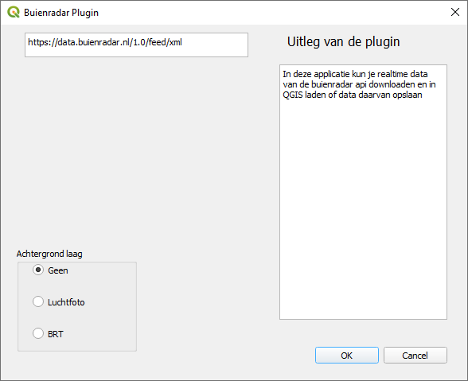

# Buienradar plugin

De buienradar plugin is gemaakt om de buienradar data (die openlijk beschikbaar is op buienradar) geografisch weer te kunnen geven. Hierbij worden de symbolen van de buienradar gebruikt om het geheel te visualiseren.

De enige vereiste is QGIS zelf.

De plugin is te installeren via QGIS.

Hieronder is een afbeelding te zien van de simpele interface. Je kunt een achtergrond kiezen en wanneer je daarna op de OK knop drukt wordt alle data ingeladen in je hoofdscherm.



## Lokaal testen tijdens ontwikkelen

De plugin heeft geen buildstap nodig: code wordt rechtstreeks door QGIS geladen. Om wijzigingen in deze repo direct te zien in QGIS, maak je een *directory junction* aan vanuit de pluginmap van je QGIS-profiel naar deze repo. Een junction vereist geen administratorrechten op Windows.

```powershell
New-Item -ItemType Junction `
  -Path "$env:APPDATA\QGIS\QGIS4\profiles\default\python\plugins\buienradar_plugin" `
  -Target "<pad naar deze repo>"
```

Vink daarna in QGIS de plugin aan via **Plugins > Manage and Install Plugins > Installed**.

Installeer ook de core-plugin **Plugin Reloader** (via Manage and Install Plugins). Na een codewijziging klik je simpelweg op het Plugin Reloader-icoon om de Buienradar plugin opnieuw te laden, zonder QGIS te herstarten.

## Releasen naar de QGIS plugin repository

1. **Testen.** Grondig testen in zowel QGIS 3 als QGIS 4 via de junction + Plugin Reloader (zie hierboven).
2. **Versie bumpen.** Verhoog `version=` in [metadata.txt](metadata.txt) en voeg een regel toe aan de `changelog=`.
3. **Zip bouwen** met `git archive` (geen extra tools nodig):
   ```bash
   git archive --prefix=buienradar_plugin/ -o buienradar_plugin.zip HEAD -- \
     __init__.py \
     buienradar_plugin.py \
     buienradar_plugin_dialog.py \
     buienradar_plugin_dialog_base.ui \
     metadata.txt \
     icon.png \
     LICENSE \
     README.md \
     svg/
   ```
   Dit maakt `buienradar_plugin.zip` met uitsluitend de runtime-bestanden, zonder `test/`, `Makefile` of andere devbestanden.
4. **Uploaden**: inloggen op plugins.qgis.org met het account dat eigenaar is van de plugin → plugin-pagina → nieuwe versie uploaden.
5. **Controleren.** Na upload valideert de repository het pakket en publiceert de nieuwe versie.

## Contact

Contributor: Peter Schols

Voor meer informatie kunt u mailen naar: jeroenvanderzwam@hotmail.com
